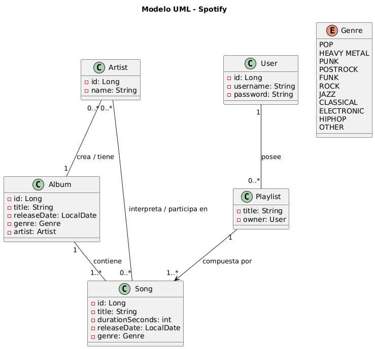

# Proyecto Spotify

Este proyecto implementa un sistema básico de gestión musical inspirado en plataformas como Spotify. El objetivo es modelar artistas, álbumes, canciones y playlists, permitiendo trabajar conceptos de POO, relaciones entre entidades, validaciones y manejo de datos.

## Descripción del sistema

El sistema cuenta con las siguientes entidades:

### Artista
- Nombre.
- Conjunto de álbumes.
- Conjunto de canciones.
- Método `info()` para mostrar nombre y cantidad de álbumes y canciones.

### Álbum
- Título.
- Fecha de lanzamiento (no puede ser futura).
- Género.
- Artista propietario.
- Lista de canciones (mínimo 1).
- Método `info()` para mostrar título, género y número de canciones.

### Canción
- Título.
- Duración.
- Fecha (no puede ser futura).
- Género.
- Puede estar en múltiples playlists.
- Método `info()` para mostrar título, duración y género.

### Género (enum)
- POP  
- HEAVY METAL  
- PUNK  
- POSTROCK  
- FUNK  
- ROCK  
- JAZZ  
- CLASSICAL  
- ELECTRONIC  
- HIPHOP  
- OTHER  

### Usuario
- Nombre de usuario.
- Contraseña.
- Conjunto de playlists.

### Playlist
- Nombre.
- Lista de canciones (1..*).
- Pertenece a un único usuario.
- Método `info()` para mostrar nombre y cantidad de canciones.
